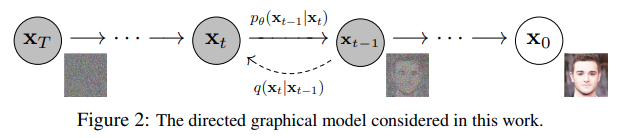
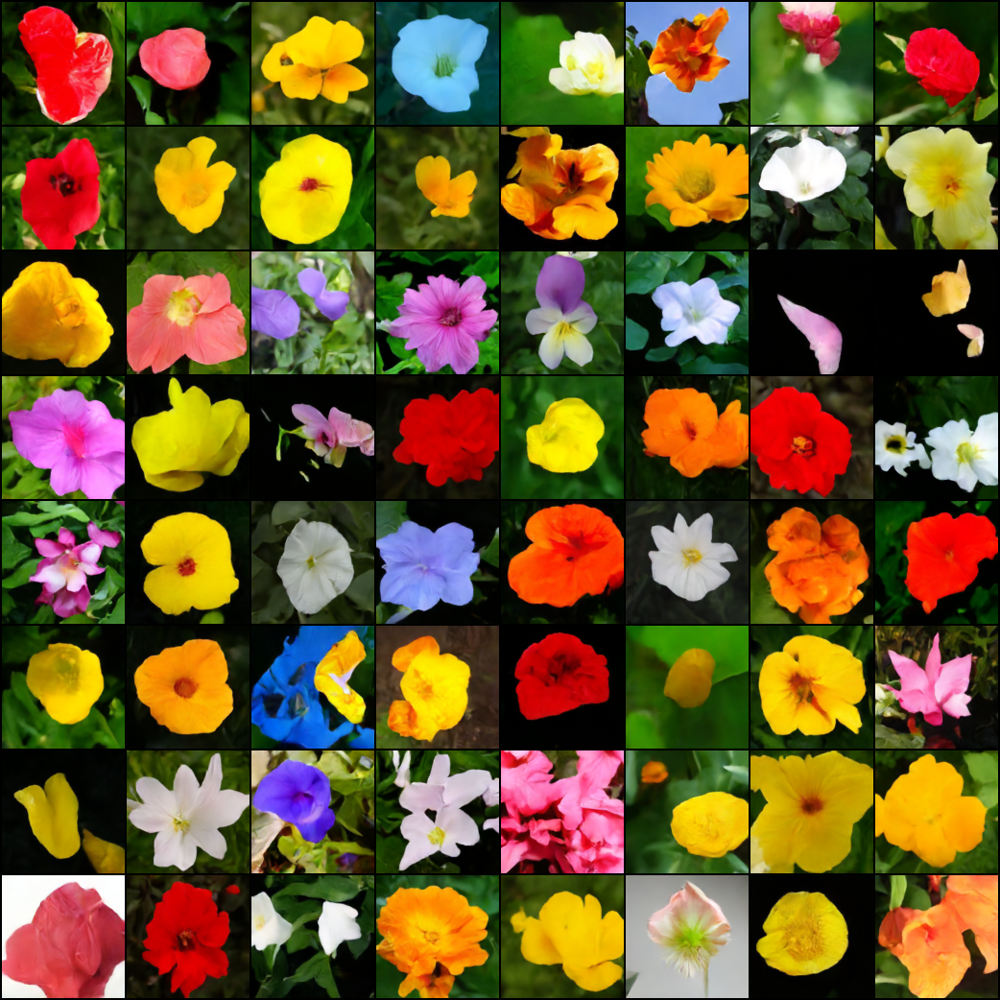

</img>

## Denoising Diffusion Probabilistic Model, in Pytorch

Implementation of <a href="https://arxiv.org/abs/2006.11239">Denoising Diffusion Probabilistic Model</a> in Pytorch. It is a new approach to generative modeling that may <a href="https://ajolicoeur.wordpress.com/the-new-contender-to-gans-score-matching-with-langevin-sampling/">have the potential</a> to rival GANs. It uses denoising score matching to estimate the gradient of the data distribution, followed by Langevin sampling to sample from the true distribution. This implementation was transcribed from the official Tensorflow version <a href="https://github.com/hojonathanho/diffusion">here</a>. 



[](https://badge.fury.io/py/denoising-diffusion-pytorch)

## Install

```bash
$ pip install denoising_diffusion_pytorch
```

## Usage

```python
import torch
from denoising_diffusion_pytorch import Unet, GaussianDiffusion

model = Unet(
    dim = 64,
    dim_mults = (1, 2, 4, 8)
)

diffusion = GaussianDiffusion(
    model,
    timesteps = 1000,   # number of steps
    loss_type = 'l1'                  # L1 or L2
)

training_images = torch.randn(8, 3, 128, 128)
loss = diffusion(training_images)
loss.backward()
# after a lot of training

sampled_images = diffusion.sample(128, batch_size = 4)
sampled_images.shape # (4, 3, 128, 128)
```

Or, if you simply want to pass in a folder name and the desired image dimensions, you can use the `Trainer` class to easily train a model.

```python
from denoising_diffusion_pytorch import Unet, GaussianDiffusion, Trainer

model = Unet(
    dim = 64,
    dim_mults = (1, 2, 4, 8)
).cuda()

diffusion = GaussianDiffusion(
    model,
    timesteps = 1000,   # number of steps
    loss_type = 'l1'    # L1 or L2
).cuda()

trainer = Trainer(
    diffusion,
    'path/to/your/images',
    image_size = 128,
    train_batch_size = 32,
    train_lr = 2e-5,
    train_num_steps = 100000,         # total training steps
    gradient_accumulate_every = 2,    # gradient accumulation steps
    ema_decay = 0.995,                # exponential moving average decay
    fp16 = True                       # turn on mixed precision training with apex
)

trainer.train()
```

## Citations

```bibtex
@misc{ho2020denoising,
    title={Denoising Diffusion Probabilistic Models},
    author={Jonathan Ho and Ajay Jain and Pieter Abbeel},
    year={2020},
    eprint={2006.11239},
    archivePrefix={arXiv},
    primaryClass={cs.LG}
}
```

```bibtex
@inproceedings{
    anonymous2021improved,
    title={Improved Denoising Diffusion Probabilistic Models},
    author={Anonymous},
    booktitle={Submitted to International Conference on Learning Representations},
    year={2021},
    url={https://openreview.net/forum?id=-NEXDKk8gZ},
    note={under review}
}
```
